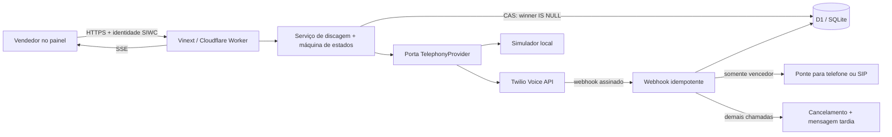

# Arquitetura

## Visão geral



## Por que D1/SQLite

O repositório estava vazio e o runtime escolhido pelo scaffold oficial Sites é Cloudflare Workers. D1 oferece SQL relacional, persistência e uma operação atômica sem adicionar PostgreSQL, Redis ou um serviço TCP incompatível com o ambiente.

A eleição usa um compare-and-set no banco:

```sql
UPDATE dial_rounds
SET winner_attempt_id = ?, status = 'winner_locked'
WHERE id = ? AND winner_attempt_id IS NULL;
```

Somente a operação cujo `changes` é `1` venceu. Todas as instâncias compartilham essa decisão. Eventos da operadora têm índice único `(provider, external_event_id)`, e comandos do usuário usam `idempotency_key` única.

## Estados

`queued → starting → ringing → answered → human_confirmed → winner → connected → completed`

Saídas terminais alternativas: `cancelled`, `busy`, `no_answer`, `voicemail`, `failed`. Um resultado AMD `unknown` permanece em `answered`; não é promovido silenciosamente.

As transições estão centralizadas em `lib/domain/state-machine.ts`. Eventos atrasados que tentam regredir um estado terminal são ignorados. Um evento humano que perde o CAS recebe uma mensagem curta e é encerrado.

## Falhas e recuperação

- Cancelamentos usam até três tentativas com backoff e a mesma chave idempotente.
- Se todas falharem, o webhook retorna `503`; o reenvio assinado e duplicado volta a tentar apenas chamadas ainda ativas.
- Reinício não perde o vencedor real porque rodada, tentativas e eventos estão em D1.
- Duplo clique e repetição do comando de início retornam a campanha existente pela chave idempotente.
- O vendedor ocupado bloqueia nova rodada no domínio; o painel também desabilita o início.
- O simulador usa armazenamento em memória somente para isolamento de testes. A suíte reinicia o serviço mantendo o mesmo store, imitando reidratação persistente.

## Segurança e privacidade

- autenticação por cabeçalhos de usuário da plataforma Sites; mutações rejeitam ausência de identidade fora de `localhost`;
- verificação de mesma origem para mutações (proteção CSRF);
- assinatura Twilio validada em tempo constante e deduplicação contra replay;
- rate limit persistente por vendedor no início de chamadas reais;
- E.164, limites de tamanho e allowlist de resultados;
- anotações cifradas com AES-256-GCM; telefone original opcionalmente cifrado;
- logs JSON filtram campos cujo nome sugira telefone, token, senha, segredo ou payload;
- bloqueio usa SHA-256 do número para consulta sem expor o telefone na lista;
- retenção configurável via endpoint interno autenticado;
- nenhuma gravação ou conteúdo da conversa é armazenado.
